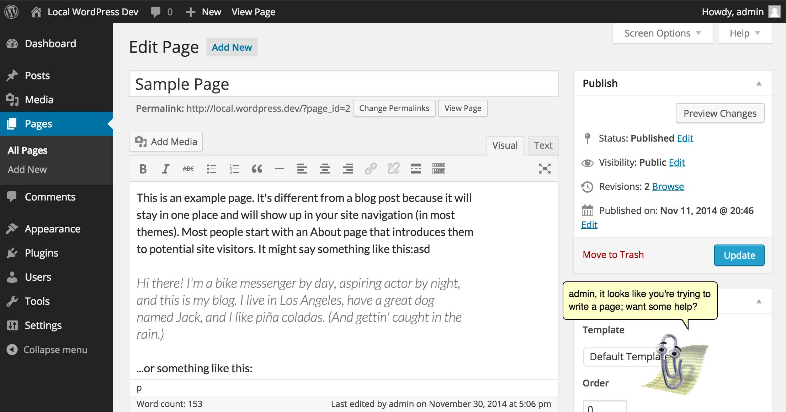

# Son of Clippy

Beginning in Office 97, [Microsoft included an Office Assistant named "Clippit"](http://en.wikipedia.org/wiki/Office_Assistant) (though his friends call him "Clippy"), a terribly annoying animated paper clip that _supposedly_ helped you write, but more often than not became a shiny thing for people to get distracted by. Clippy gained friends throughout the years, including Merlin (a wizard), Rover (a dog), and Links (a cat). Clippy was retired in Office 2007, but the legacy of Clippy and Friends lives on to this day.

After Clippy had been around long enough to be considered ironically funny (no judgement here, this is a whole plugin around the same joke), [Smore](https://www.smore.com/), an online flyer design tool, introduced [Clippy.js](https://www.smore.com/clippy-js), a JavaScript-powered implementation of Clippy and friends for the modern web. Clippy.js serves as the backbone of this plugin.

**Note:** In case you haven't realized it yet, this plugin won't do anything useful for you, but will add an animated character to your WordPress post edit screen. You can drag the character around, click on it, and watch it interact with your mouse, but this is strictly a novelty plugin.

## Frequently asked questions

### Will this plugin help make me a better writer?

Absolutely not. Paper clips are great at holding paper together, but are rarely commended for their writing abilities. Their lack of ethics, due primarily to their absence of independent thought and general "alive-ness" also makes paper clips (and familial office products) wholly unqualified as journalists.

### That paper clip is awful, how can I make it a cat?

What an oddly-specific question.

If you're sick of Clippy and its annoying face, there's a whole cast of characters to choose from including a wizard, genie, and yes, even a cat. Your assistant can be configured by visiting the Writing settings page within WordPress.

## License

Copyright (c) 2014 Steve Grunwell

This program is free software; you can redistribute it and/or modify
it under the terms of the GNU General Public License, version 2 or, at
your discretion, any later version, as published by the Free
Software Foundation.

This program is distributed in the hope that it will be useful,
but WITHOUT ANY WARRANTY; without even the implied warranty of
MERCHANTABILITY or FITNESS FOR A PARTICULAR PURPOSE.  See the
GNU General Public License for more details.

You should have received a copy of the GNU General Public License
along with this program; if not, write to the Free Software
Foundation, Inc., 51 Franklin St, Fifth Floor, Boston, MA  02110-1301  USA